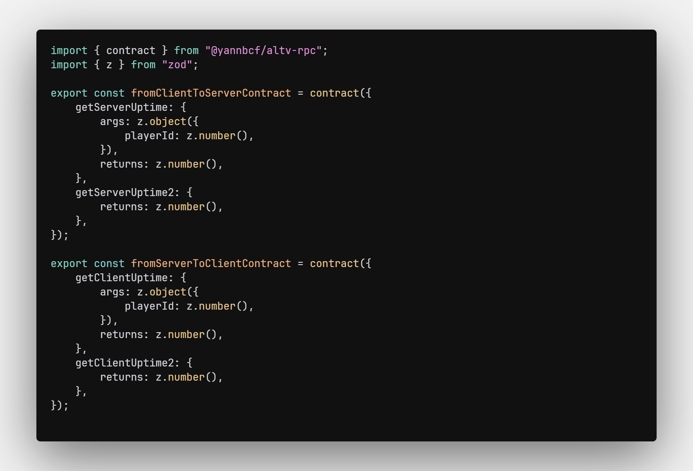
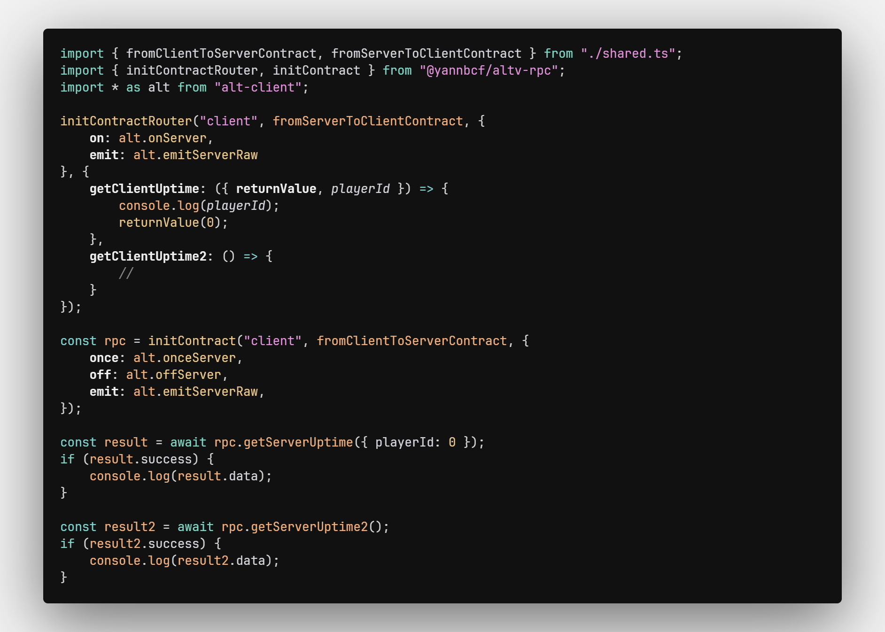
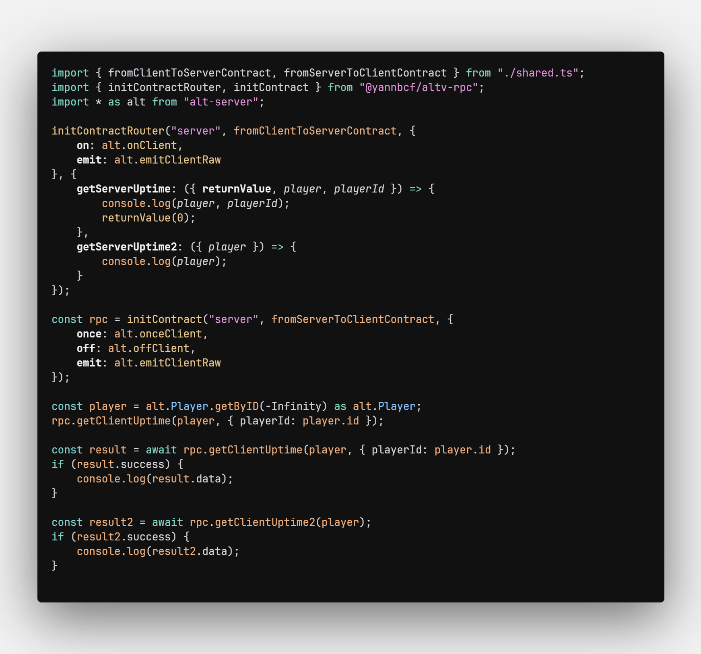

# alt:V RPC library

> disclaimer: the library is new and experimental

## Features

- End to end type safety
- RPC-like client-server interface
- Tiny bundle size (1.3kb gzipped)
- No code generation
- Zod support for runtime type checks

## Roadmap

- [X] 100% typesafety
- [ ] optional runtime arguments evaluation
- [ ] wss backend support
- anti-cheat support
    - [ ] event names obfuscation via a compiler
    - [ ] events rate limiting
    - [ ] unhandled events detection

## Installation

```
> pnpm
pnpm add @yannbcf/altv-rpc zod

> yann
yann add @yannbcf/altv-rpc zod

> npm
npm install @yannbcf/altv-rpc zod
```

## Usage

Create a contract, implement it in your browser, alt:V client or server side and consume it !
The supported communications are:

``web <-> client``

``client <-> server``


- Shared


- Client


- Server

